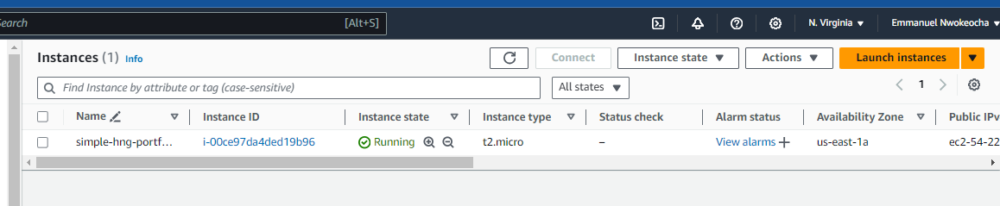
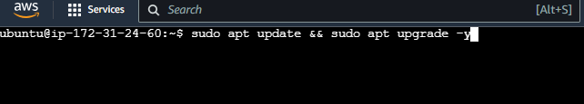
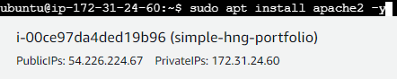
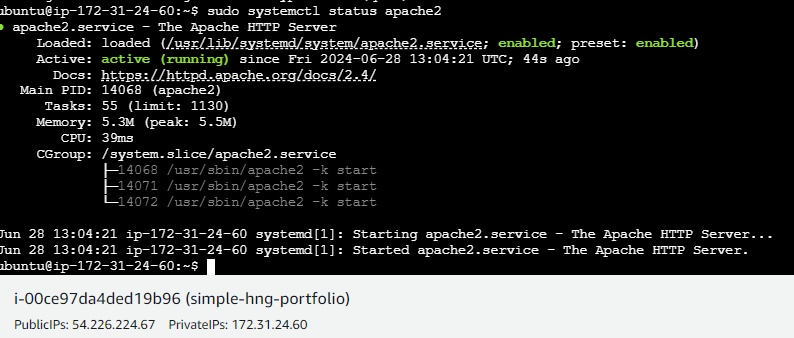
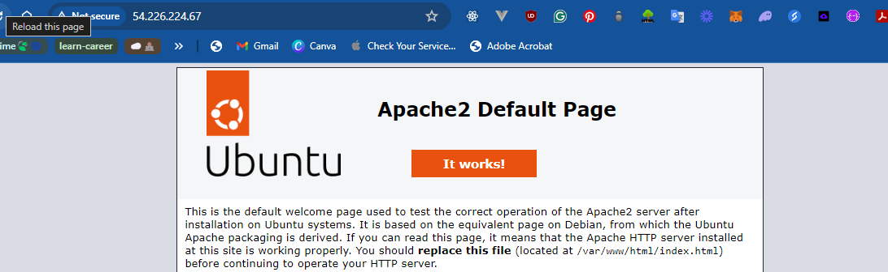
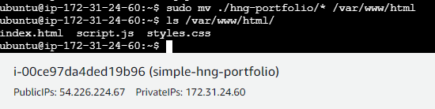
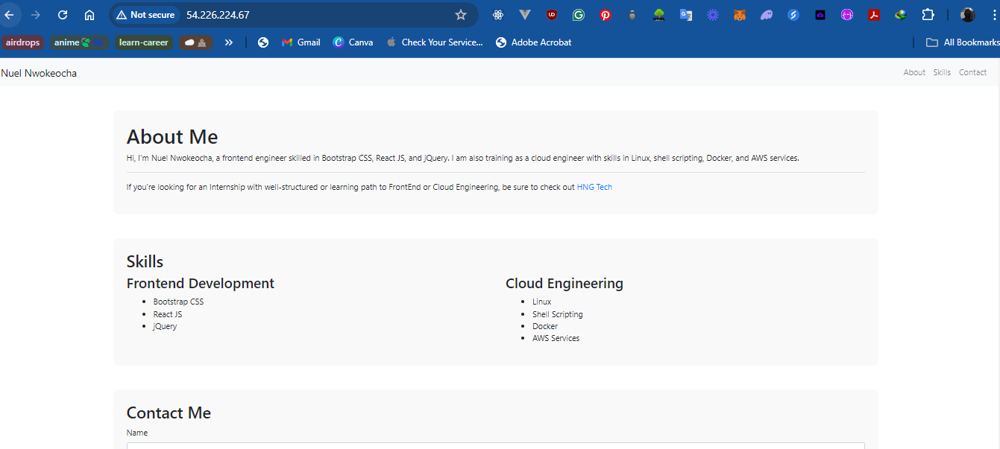

# Deploying Apache Web Server on AWS EC2

## Steps Involved

### Step 1: Spin Up an EC2 Instance

1. **Navigate to the EC2 Dashboard** in the AWS Management Console.
2. **Click "Launch Instance"**.
3. **Choose an Amazon Machine Image (AMI)**:
   - Select **Ubuntu Server 20.04 LTS** (or another preferred version).
4. **Select an Instance Type**:
   - Choose `t2.micro` (eligible for the free tier).
5. **Configure Instance Details**:
   - Use default settings or adjust as needed.
6. **Add Storage**:
   - Default storage configuration should be fine.
7. **Add Tags** (optional):
   - Add tags for better resource management.
8. **Configure Security Group**:
   - Create a new security group or use an existing one.
   - Add a rule to allow HTTP traffic on port 80:
     - Type: HTTP
     - Protocol: TCP
     - Port Range: 80
     - Source: Anywhere (0.0.0.0/0)
9. **Review and Launch**:
   - Review your settings and click **Launch**.
   - Select or create a key pair for SSH access, and download it.




### Step 2: Run Necessary APT Updates

1. **Connect to your EC2 instance** using SSH with the key pair.
2. Update the package manager:

   ```bash
   sudo apt update
   sudo apt upgrade -y
   ```




### Step 3: Install Apache2 and Check Apache2 Status

1. Install Apache2:

   ```bash
   sudo apt install apache2 -y
   ```

2. Check Apache2 status:

   ```bash
   sudo systemctl status apache2
   ```






### Step 4: Verify Apache is Working by Visiting Public IP

1. **Find the public IP address** of your EC2 instance from the Instances dashboard.
2. **Open a web browser** and enter the public IP address.
3. You should see the Apache2 default page.




### Step 6: Create Website Files in New Directory

1. Connect to your EC2 instance and use `nano` to create new HTML, CSS and JS files:

   ```bash
    mkdir hng-portfolio && cd hng-portfolio
   ```

   ```bash
   nano index.html
   nano styles.css
   nano script.js
   ```

2. Add your HTML, CSS, JS content and save the respective files.


### Step 7: Move Web Files to /var/www/html

1. Move your web files to the Apache document root:

   ```bash
   cd ~
   sudo mv ./hng-portfolio/* /var/www/html/
   ```




### Step 8: Restart Apache2

1. Restart the Apache2 service to apply changes:

   ```bash
   sudo systemctl restart apache2
   ```


### Step 9: Check Public IP Again (Now with Our Webpage Hosted)

1. Open your web browser and enter the public IP address again.
2. You should now see your hosted webpage.



---

Voila! Your webpage is hosted on Apache2
